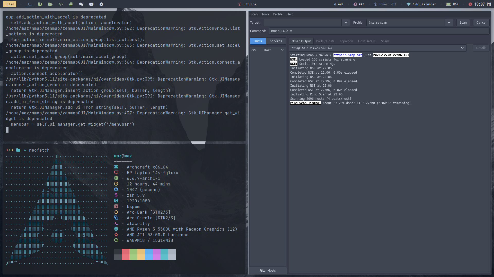

# Zenmap Installer Script



This script automates the installation of Nmap dependencies and Zenmap on Debian-based systems.


## Compatibility

The script has been tested and confirmed to work on:

- Debian-based distributions (Debian, Ubuntu, etc.)

## Prerequisites

- This script is intended for Debian-based systems.
- Ensure you have administrative privileges (use `sudo`).
- Internet connectivity is required for package updates and installations.

## Usage

1. Clone the repository or download the `zenmap-installer.sh` file.
2. Open a terminal and navigate to the directory containing the script.
3. Run the script with administrative privileges using:

    ```bash
    sudo ./zenmap-installer.sh
    ```

4. Follow on-screen prompts (if any) and monitor the terminal for any error messages or completion messages.
5. After the script finishes running, Zenmap should be installed and ready to use.

## Notes

- This script requires root privileges (`sudo`) to install packages and build Nmap.
- It automatically checks for root permissions and verifies the installation of necessary dependencies.
